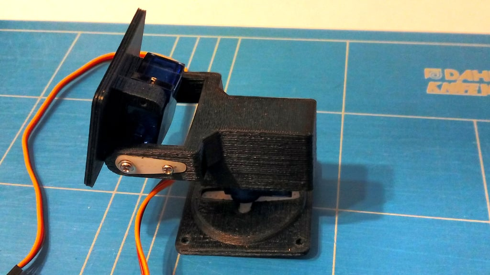

# AI powered webcam

With a raspberry pi zero 2 w, camera module, 2x SG90 servo's, custom 3D printed case and this software you can create an AI powered webcam that follows a person and can autofocus and pan/tilt.

## Hardware
- Raspberry Pi Zero 2 W
- Raspberry Pi 5 8MP IMX219 Camera Module
- 2x SG90 Servo Motors
- Custom 3D Printed Case (available on [Thingiverse](https://www.thingiverse.com/thing:708819))
- Micro USB to USB-A male OTG Cable



## Installation
To set up the AI powered webcam on your Raspberry Pi (zero 2w), follow these steps:

0. Clone the repository:
   ```bash
   git clone https://github.com/AlbertovanEckeveld/ai-webcam.git
   ```
1. Install the required packages:
   ```bash
   sudo apt install python3-pip python3-dev libatlas-base-dev libopenjp2-7 libtiff5 v4l2-ctlq
   ```
   
2. Install the required Python packages:
   ```bash
    pip3 install -r requirements.txt
    ```

3. Add to config.txt on the boot partition: 
   ```bash
   dtoverlay=dwc2
   ```
4. Add to cmdline.txt after rootwait:
    ```bash
    modules-load=dwc2,g_ether rootwait
    ```
5. Place usb-webcam.sh script in /usr/bin/ and make it executable
    ```bash
    sudo cp usb-webcam.sh /usr/bin/usb-webcam.sh
    sudo chmod +x /usr/bin/usb-webcam.sh
    ```
6. Add the script to crontab to start automatically on boot:
   ```bash
   sudo crontab -e
   ```
   Add the following line:
   ```bash
   @reboot /usr/bin/usb-webcam.sh
   @reboot python3 main.py
   ```
   
7. Reboot the Raspberry Pi:
   ```bash
    sudo reboot now
    ```
   
